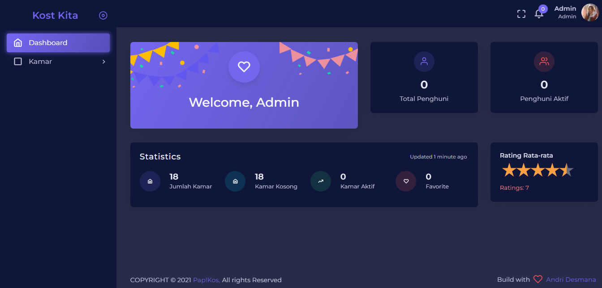

Follow github saya 
http://github.com/Arfiyan19

Halo, ini adalah Kost Kita aplikasi Pencarian Kost dan Apartement, desain dan fitur sebagian terinpirasi dari aplikasi Mamikos.  Aplikasi ini akan terus mendapat update secara berkala.
 Mohon untuk memberi issue jika kalian menemui bug pada saat penginstalan atau saat menggunakan aplikasi ini. Terima kasih  
    
## Requirements

* PHP 7.3 or higher
* Database (eg: MySQL)
* Web Server (eg: Apache, Nginx, IIS)
    
## Framework

Pap!Kos dibangun menggunakan [Laravel](http://laravel.com), the best existing PHP framework, as the foundation framework.

## Installation

* Install [Composer](https://getcomposer.org/download) and [Npm](https://nodejs.org/en/download)
* Clone the repository: `git clone https://github.com/andes2912/kos.git`
* Install dependencies: `composer install ; npm install ; npm run dev`
* Run `cp .env.example .env` for create .env file
* Run `php artisan migrate --seed` for migration database
* Detail login, Email : `admin@gmail.com` Password `1234567`

## Tampilan 
Home User/Pencari Kost  

  

--Menu boking Users
   

--Detail Kamar 
 
 

--Menu List User Booking
 

--Menu List User Payment
 

--Menu User dashboard
   

--MENU PEMILIK KOST
-- Dashoboard Pemilik Kost
  

--Menu Kamar
   

--Menu Tambah Data Kamar
 
 

--Menu List User Booking
   

--Menu Admin
--Dashboard Admin
 
--List Kamar dan Proses Setujui Admin
